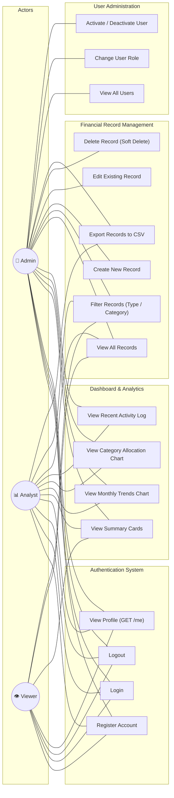
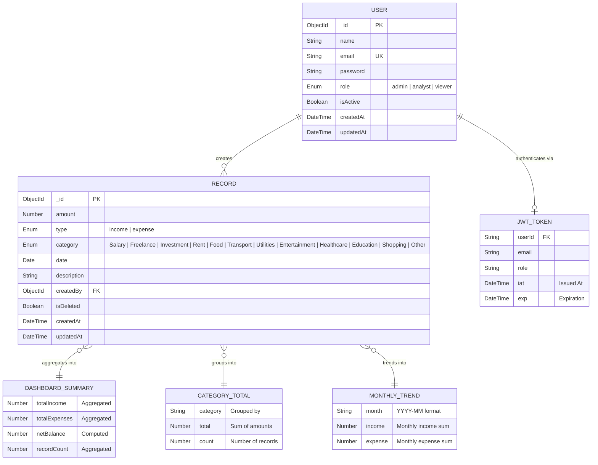
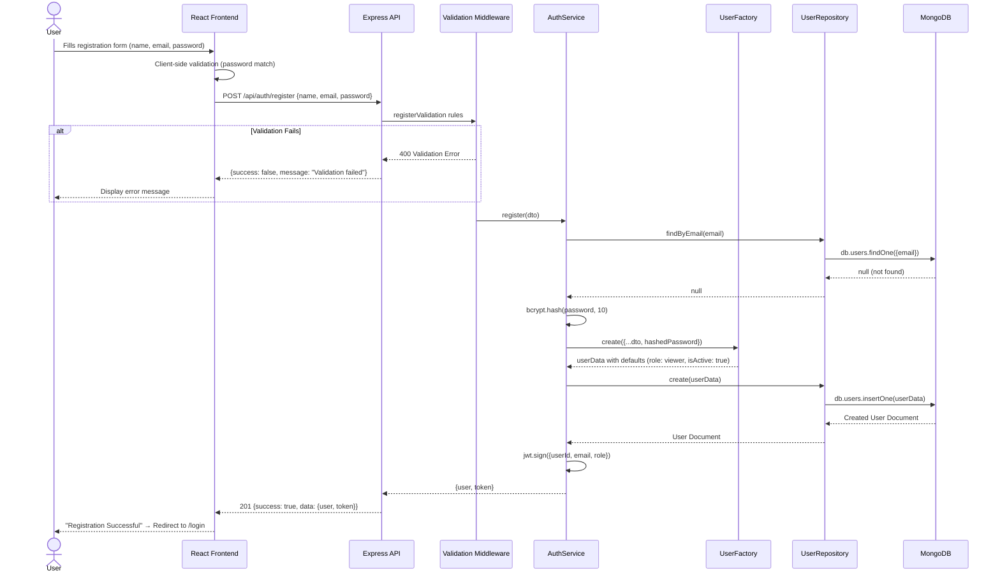
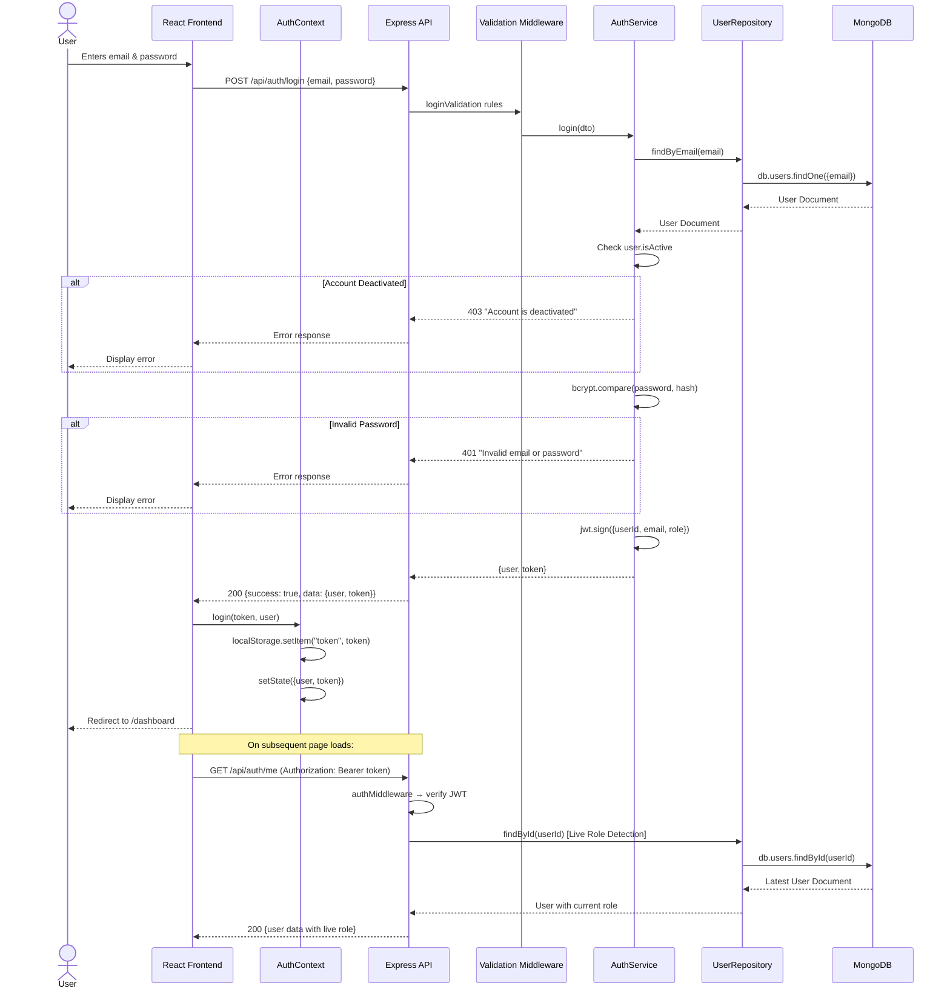
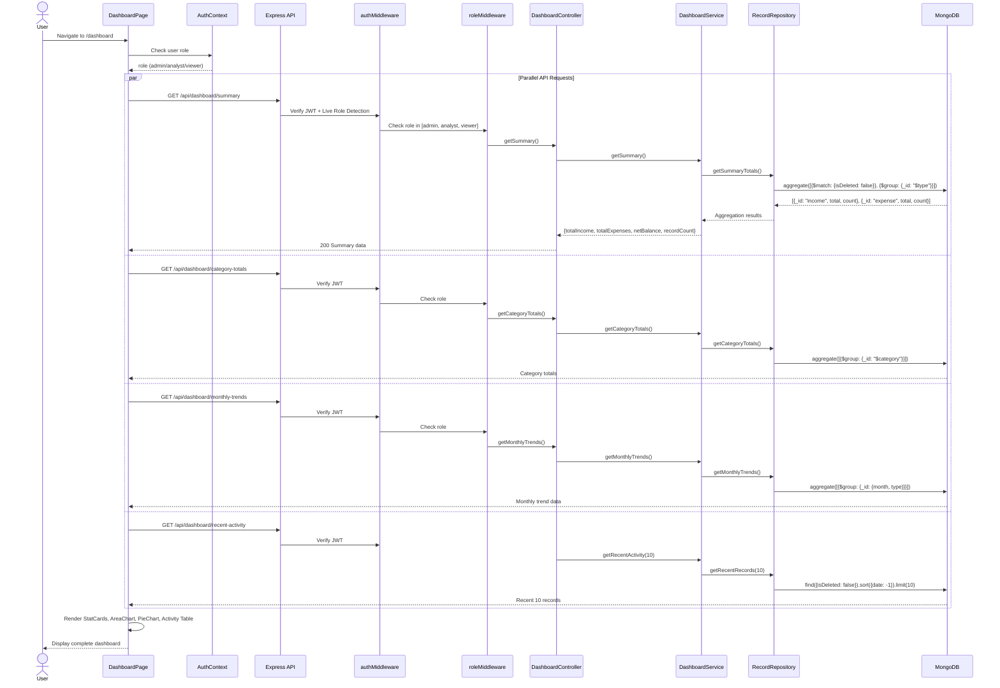
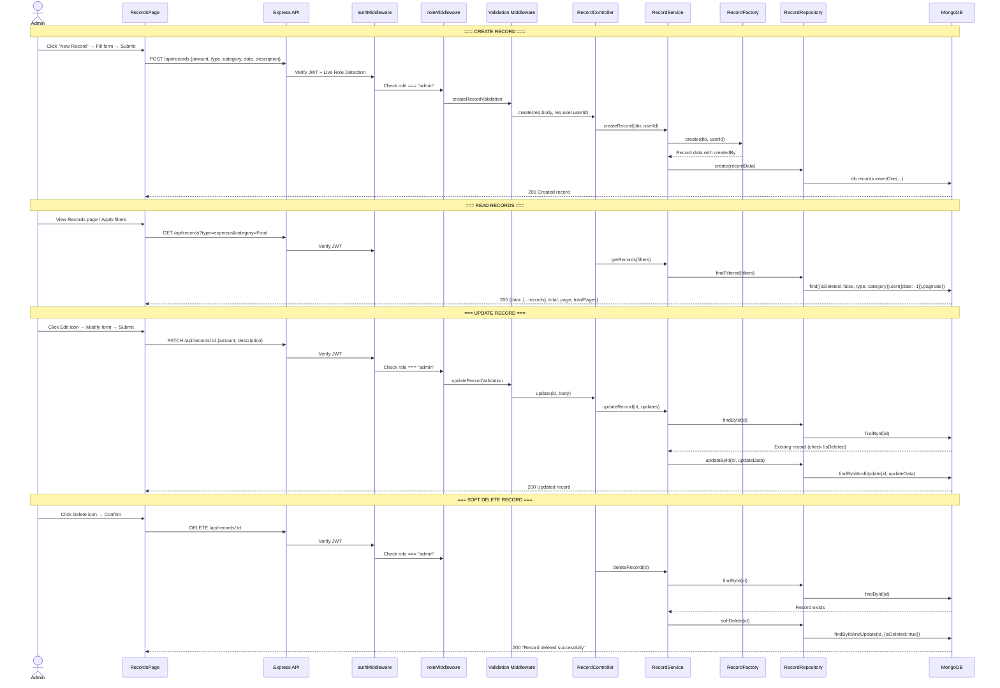
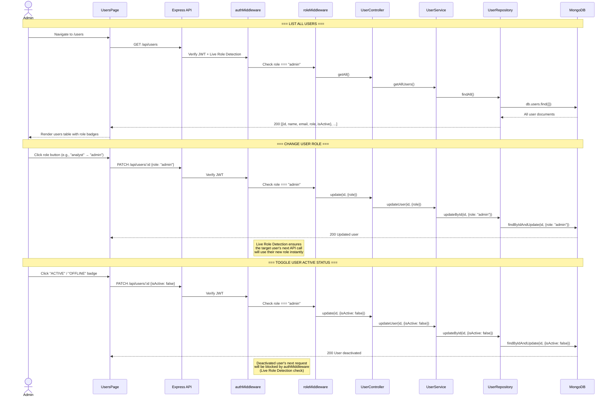
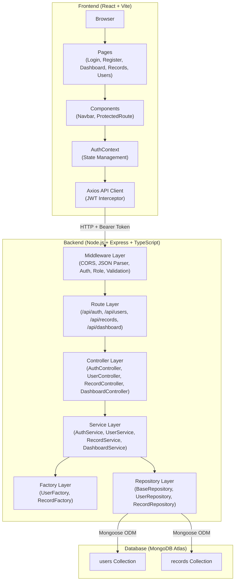

# 🏗️ Finance Dashboard — System Architecture

> Comprehensive architectural documentation for the **FinanceX** Premium Financial Audit System, covering use cases, data models, and interaction sequences.

---

## 📋 Table of Contents

1. [Use Case Diagram](#1-use-case-diagram)
2. [ER Diagram](#2-er-diagram)
3. [Sequence Diagrams](#3-sequence-diagrams)
   - [User Registration](#31-user-registration)
   - [User Login & Session Initialization](#32-user-login--session-initialization)
   - [Dashboard Data Loading](#33-dashboard-data-loading)
   - [Financial Record CRUD Operations](#34-financial-record-crud-operations)
   - [Admin User Management](#35-admin-user-management)

---

## 1. Use Case Diagram

This diagram illustrates the interactions between the three user roles (**Admin**, **Analyst**, **Viewer**) and the system's core functionalities.

### Role Permission Summary

| Capability                  | Admin | Analyst | Viewer |
| :-------------------------- | :---: | :-----: | :----: |
| Register / Login / Logout   |  ✅   |   ✅    |   ✅   |
| View Summary Cards          |  ✅   |   ✅    |   ✅   |
| View Charts & Trends        |  ✅   |   ✅    |   ❌   |
| View Recent Activity Log    |  ✅   |   ✅    |   ❌   |
| View Financial Records      |  ✅   |   ✅    |   ✅   |
| Filter Records              |  ✅   |   ✅    |   ✅   |
| Create / Edit / Delete Records |  ✅   |   ❌    |   ❌   |
| Export CSV                  |  ✅   |   ✅    |   ❌   |
| Manage Users & Roles        |  ✅   |   ❌    |   ❌   |

---

## 2. ER Diagram

This Entity-Relationship diagram shows the data models stored in MongoDB and their relationships.

### MongoDB Indexes

| Collection | Index                             | Purpose                          |
| :--------- | :-------------------------------- | :------------------------------- |
| `users`    | `email` (unique)                  | Fast login lookups               |
| `records`  | `{ type: 1, category: 1, date: -1 }` | Compound filter & sort queries |
| `records`  | `{ isDeleted: 1 }`               | Efficient soft-delete filtering  |

---

## 3. Sequence Diagrams

### 3.1 User Registration

### 3.2 User Login & Session Initialization

### 3.3 Dashboard Data Loading

### 3.4 Financial Record CRUD Operations

### 3.5 Admin User Management

---

## 🧱 System Architecture Overview

---

> **Note:** All diagrams reflect the current implementation. The system follows a strict **Repository → Service → Controller** layered architecture with JWT-based authentication and **Live Role Detection** for real-time permission enforcement.
